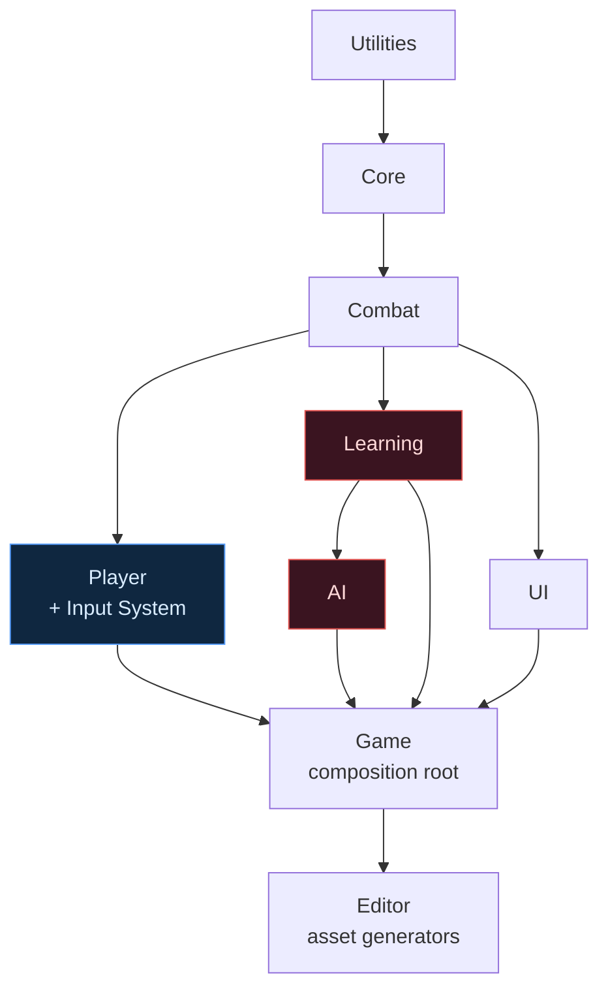

# Adaptive Boss Arena

**A single-encounter action game where the boss studies you.** Fight one boss in one arena; it builds
a statistical profile of your habits — how you attack, dodge, space and panic — and counter-adapts to
punish them, *without ever reading your input*. Winning means noticing it has adapted, and adapting back.


[](https://shadow-46.github.io/adaptive-boss-arena/)

▶ **[Play in your browser](https://shadow-46.github.io/adaptive-boss-arena/)** — no install, runs the WebGL build straight from GitHub Pages.
⬇ **[Download for Windows](https://github.com/Shadow-46/adaptive-boss-arena/releases/latest)** — unzip and run `AdaptiveBossArena.exe`.

It's a Sekiro-style deflect duel built in Unity 6, **entirely from code-generated assets** (no
hand-authored scenes or prefabs), and it never lets the boss cheat:

> **The one rule that outranks the rest.** The boss may not read your input, buffered input, stamina,
> cooldowns or invincibility frames. It reacts only to what a human opponent could perceive on screen,
> and only after a human-plausible delay. This is enforced by the **assembly dependency graph** — the
> AI and learning code literally cannot compile against the code that would let them cheat, and a test
> fails the build if that boundary is ever breached. See [Docs/ARCHITECTURE.md](Docs/ARCHITECTURE.md).

### The anti-cheat firewall



The **AI** and **Learning** assemblies have **no arrow to Player or the Input System** — that missing
edge is the firewall. All the player state the boss is allowed to know reaches it through a delayed,
perception-limited channel, so feints genuinely work and the fight stays fair.

### Adapting back

The boss reading you is only half of it. Every counter it adopts announces itself with a **tell**, and
each one is an over-commitment you can turn around:

1. It reads a habit — how you attack, where you stand, whether you answer with the guard or with your
   feet — and presses it. *"It stops respecting your guard."*
2. You change the habit. Its committed swings start finding empty air.
3. **It overbalances.** A swing it leaned into and missed leaves the boss stumbling, unable to attack
   and taking amplified posture damage — the harder it had committed, the worse the stumble.
4. You punish the opening into a posture break and the execution.

So the counter that was beating you becomes the thing that opens it up. Adaptation only ever changes
**numbers, never rules** — the boss gains no move it did not already have — and it is dormant until it
has genuinely learned something, so an opening fight plays clean.

---

## Status

**All seven build phases complete, plus a top-tier polish pass — the game runs end to end from a
title screen through a framed, animated fight.**

There is a fight. You can move, dash, combo, heal, deflect, build focus, and be staggered. The boss
watches you, escalates through four phases (ending in a desperation **Last Stand**) with dramatic
transitions, strings its attacks into combos, throws unblockable "perilous" attacks and arena-scarring
set-pieces, and gradually develops answers to whatever you keep doing — including how you *defend*,
reading whether you hide behind the guard and how precisely you deflect. Out-read a counter and the
boss overbalances, handing you the opening. It is wrapped in a title screen, a "ready — fight" intro,
slow-motion outcome beats, a post-fight dossier on how it read you, challenge modifiers, and a working
settings menu.

| Phase | Scope | Status |
|-------|-------|--------|
| 1 | Architecture, contracts, tooling, tests | ✅ Complete |
| 2 | Player controller — movement, dash, stamina | ✅ Complete |
| 3 | Combat — hitboxes, combos, stagger, hit-stop | ✅ Complete |
| 4 | Boss AI — state machine, attacks, phases | ✅ Complete |
| 5 | Learning system — profiling and adaptation | ✅ Complete |
| 6 | UI, settings, save system | ✅ Complete |
| 7 | Polish — post-processing, audio, tuning | ✅ Complete |

### Polish pass (the primitives, brought to life)

- **Procedural character animation.** The capsules anticipate, lunge, follow through, recoil from
  hits and topple on death — all code-driven, no rigs. Camera punch-in on heavy hits and deflects.
- **Game framing.** A generated title scene, a "READY? / FIGHT!" beat before the fight, and a
  slow-motion beat on the decisive blow.
- **Boss escalation.** Phase transitions roar, shockwave, flare an escalating aura and briefly turn
  the boss untouchable; later phases chain attacks into combos.
- **Settings & onboarding.** Volume, screen-shake and accessibility options that apply live and
  persist, reachable from the title and the pause menu, alongside an on-screen controls reference and
  **rebindable keys** — click a control, press a new key, and it is saved with the rest of your
  settings. "Reset Controls" restores the defaults.
- **Adaptive audio.** The score is three stacked, procedurally-generated loops — a bed, a tension
  layer, and a driving pulse — that fade in as the boss escalates, so the music rises with the fight.
- **A reactive arena.** The lighting and ambience shift from cool and even to hot and red across the
  boss's phases, so the room itself tells you the encounter is turning.
- **Reactive screen.** The frame reddens and desaturates as you near death, jolts when you are hit,
  and flares with a lens punch on a clean deflect — all defeatable with the reduced-flashing setting.
- **Distinct weapons.** The three archetypes now swing genuinely different movesets: the Blade's
  balanced three-hit chain, the Greatsword's slow, heavy two-hit power, and the Energy Blade's rapid
  four-hit flurry — each with its own defence style (see below).
- **Ready for real art.** The mechanics are complete on primitives, and four dormant, null-safe seams
  are in place so dark-fantasy characters, weapons, ability VFX and environments drop in without a
  code change. See [`Docs/ART_INTEGRATION.md`](Docs/ART_INTEGRATION.md).

### Depth pass

- **Post-fight dossier.** When the fight ends, the boss shows its read on *you*: the habits it grew
  confident in (with how sure it was), the counters it developed, and your deflects, perfect dodges
  and health left. The "it studied you" story finally lands on screen, not just in the F1 overlay.
- **Challenge modifiers.** Chosen on the title screen and remembered: *Fast Learner* (it adapts twice
  as fast), *No Healing*, *Fragile*, and a *Training* mode that keeps the belief overlay on and holds
  you one hit above death so you can practise reading the boss. Active challenges show on the dossier.
- **Focus & empowered specials.** A focus meter fills as you deflect and perfect-dodge, and a full
  meter turns your next special into a stronger, violet-lit version — reward the game's central act,
  clean defence, with a harder answer of your own. A stagger takes all of it.
- **A desperation phase.** Below 15% health the boss enters a **Last Stand** — the same roar-and-flare
  transition, but with its fullest moveset, shortest recovery and fastest learning, the arena burning
  brightest. Each phase also has a **signature attack** it reaches for more often, so every stretch of
  the fight has a recognisable threat.

### Space and reads

- **Arena hazards.** The boss's ground slams and shockwaves scar the floor with lingering danger
  zones. They chip lightly but cover ground and stack up — especially in Last Stand — so you can no
  longer circle freely and trade; the arena is a space you have to manage. (They only threaten you —
  the boss is unburned by its own fire.)
- **Unblockable "perilous" attacks.** Some boss attacks flash a pulsing red and **ignore your guard
  entirely** — block one and you eat it in full. They must be *dodged*, adding a block-vs-dodge read
  on top of the deflect timing.
- **Set-piece phase transitions.** Entering a phase is now a *survive this*: the boss erupts into a
  telegraphed, unblockable arena-wide shockwave that leaves the ground scorched behind it.
- **The execution.** Break the boss's guard and your riposte becomes a devastating **execution**; when
  it's the killing blow, the world crawls into a deep cinematic finish.
- **Resolve & the gambit.** The boss builds *Resolve* as the fight drags on and, faster, each time you
  dodge one of its swings — you can watch it charge as the boss glows brighter. Full, it spends the
  meter on a signature **gambit**: that same perilous, arena-scarring shockwave. Dodge it, and the
  cycle resets. It never reads your input; it answers the shape of the fight.

**Press F1** for the debug overlay. The heads-up display shows what is happening; the overlay shows
what the boss *believes*, which is the only way to tune the encounter.

### How to run

Open the project, open `Assets/_Project/Scenes/MainMenu.unity`, and press Play — or build, which
boots to the title. If the generated assets are ever missing, run
`Adaptive Boss Arena/Setup/Run Full Setup`.

### Controls

| Action | Keyboard / Mouse | Gamepad |
|--------|------------------|---------|
| Move | WASD or arrow keys | Left stick |
| Dash | Space | B / Circle |
| Light attack | Left mouse | X / Square |
| Heavy attack | Right mouse | Y / Triangle |
| **Guard / deflect** | **Left Shift** | Left shoulder |
| Special | Q | Right shoulder |
| Heal | R | D-pad up |
| Swap weapon | V | D-pad right |
| Lock on / off | Tab | — |
| Cycle camera | C | — |
| Debug overlay | F1 | — |
| Pause | Escape | Start |

### The deflect

Guard is the heart of the fight. A hit arriving in the **first 0.15 seconds** of raising your guard
is *deflected* — negated entirely, and it costs the boss posture. Later than that it is merely
*blocked*: you survive, but you take chip damage and it costs **your** posture.

Deflecting is the aggressive option, not the safe one. Blocking bleeds your posture until it breaks;
deflecting bleeds theirs. Empty the boss's posture bar and a **riposte** opens.

Keep deflecting on a predictable rhythm and the boss will eventually learn to **feint** — showing a
real telegraph and cancelling it. The counter is to stop being predictable.

### The three weapons

| Weapon | Handling | Defence |
|--------|----------|---------|
| Blade | Balanced | Tight 0.20s deflect, heavy posture damage |
| Greatsword | Slower, costlier swings | **No parry** — hyper-armour instead: its committed swings shrug off incoming hits and cannot be staggered mid-strike (the recovery still can) |
| Energy Blade | Faster, cheaper swings | Forgiving 0.28s guard that bleeds posture slower, so it can be *held* against a flurry |

Which one you favour is itself a habit the boss profiles. The three defence styles are enforced by a
small, unit-tested decision (`Combat/DefenceResolver.cs`), so the trade each weapon makes is a real
rule, not flavour text.

Light attacks chain into a three-hit combo if you press again during the recovery window. Dashing
just as an attack lands is a **perfect dodge** and rewards you with a brief slow-motion window to
punish from.

---

## How the boss learns

The boss builds a picture of you from things it could legitimately have seen: how often you swing,
which way you roll, how far away you like to stand, whether you attack the instant a dodge ends,
how often you break off to heal, and whether your perfect dodges land on the exact same frame every
time. Every few seconds it recomputes that picture, and occasionally it develops an answer to
whichever habit it has the best evidence for — eight distinct counters in all, each with its own
tell. Lean on heavies and it starts parrying them; heal too freely and it lunges the moment you
falter; dodge on a flawless rhythm and it begins feinting to turn that timing against you.

Some things worth knowing while playing:

- **It never reads your input.** This is enforced by the assembly graph, not by discipline — see
  [Docs/ARCHITECTURE.md](Docs/ARCHITECTURE.md).
- **It reacts on a delay.** Every observation it acts on is about 140 ms stale, so feints work.
- **It tells you when it changes.** Every adaptation announces itself. If you never see a message,
  it has not adapted.
- **It forgets.** Stop doing the thing it countered and the counter drains away. Changing tactics is
  a real answer, not a temporary reprieve.
- **It is fallible.** It sometimes fails to punish an opening a perfect player would have taken.

Try fighting it badly on purpose — spam heavy attacks, or roll left every single time — and watch
the overlay to see the confidence in that habit climb before the counter arrives.

---

## Getting set up

### 1. Install Unity

This project targets **Unity 6.3 LTS (6000.3.x)**, supported until December 2027.

1. Install [Unity Hub](https://unity.com/download).
2. In the Hub, go to **Installs → Install Editor** and choose the latest **Unity 6.3 LTS**.
3. No extra modules are required to run in the editor. Add **Windows Build Support (IL2CPP)** if you
   intend to produce a standalone build.

Any Unity 6.3 patch release works. `ProjectSettings/ProjectVersion.txt` names one specific patch;
the Hub will offer to open the project with whichever 6.3 build you have installed.

### 2. Open the project

In Unity Hub, choose **Add → Add project from disk** and select this folder. The first import takes
a few minutes while packages resolve and the Library folder is built.

Expect **zero compile errors** in the Console after import. Anything else is a bug worth reporting.

### 3. Run first-time setup

Unity cannot create the project's layers, physics rules or scene from the files in source control,
so those are generated by code. From the menu bar:

**Adaptive Boss Arena → Setup → Run Full Setup**

This runs three steps in order:

| Step | What it does |
|------|--------------|
| Configure Project | Creates layers and tags, builds the collision matrix, pins physics to 60 Hz |
| Configure Render Pipeline | Creates and assigns the URP asset — without this everything renders magenta |
| Generate Default Assets | Creates attack, strategy, config and event-channel assets |
| Retune Generated Assets | Rewrites tuning numbers into assets that already exist, keeping their GUIDs. Run this after changing a value in `DefaultAssetGenerator`, which otherwise only affects assets created from scratch |
| Generate Input Actions | Creates the keyboard, mouse and gamepad bindings |
| Generate Player Prefab | Builds the player from primitives and wires its references |
| Generate Boss Prefab | Builds the boss from primitives and wires its references |
| Build Arena Scene | Generates the arena, lighting, camera, and spawns both combatants |

The order is a dependency chain — the prefab needs the config assets and bindings, the scene needs
the prefab — so prefer **Run Full Setup** unless you know why you are running one alone. Individual
steps are safe to re-run; existing assets are kept, not overwritten.

### 4. Verify

- Open `Assets/_Project/Scenes/Arena.unity` and press **Play**. The blue capsule is you; the larger
  red one is the boss. It should approach, telegraph, and swing at you. Press **F1** for the debug
  overlay.
- Open **Window → General → Test Runner → EditMode → Run All**. All tests should pass, including
  `ArchitectureFirewallTests`, which verifies the boss cannot reach player input.

### Verifying without opening the editor

Everything above also runs headless, which is what continuous integration should use. Both setup
and the test suite are batch-safe — they skip their confirmation dialogs when `Application.isBatchMode`
is true.

Compile the project and report any errors:

```bash
"C:\Program Files\Unity\Hub\Editor\6000.3.20f1\Editor\Unity.exe" -batchmode -quit -nographics -projectPath . -logFile compile.log
```

Regenerate every asset, prefab and the scene from scratch:

```bash
"C:\Program Files\Unity\Hub\Editor\6000.3.20f1\Editor\Unity.exe" -batchmode -quit -nographics -projectPath . -logFile setup.log -executeMethod AdaptiveBossArena.Editor.ProjectSetupRunner.RunFullSetup
```

Run the full edit-mode suite and write JUnit-style results:

```bash
"C:\Program Files\Unity\Hub\Editor\6000.3.20f1\Editor\Unity.exe" -batchmode -nographics -projectPath . -runTests -testPlatform EditMode -testResults test-results.xml -logFile tests.log
```

### Reproducing a fight

`GameBootstrapper` on the `--- Managers ---` object has a **Random Seed** field. Leave it at zero
for a fresh seed each run; set it to a specific value to make every random decision — including, in
later phases, the boss's counter-strategy choices — replay identically. The seed in use is printed
to the console at startup.

---

## Repository layout

```
Assets/_Project/Scripts/
├── Utilities/    Pure algorithms — ring buffers, moving averages, histograms
├── Core/         Interfaces, data types, services. Depends on nothing but Utilities
├── Combat/       Attack definitions and hit resolution
├── Player/       Player character. The only gameplay assembly that touches input
├── Learning/     Behaviour analysis and counter-strategy selection
├── AI/           Boss state machine and decision making
├── UI/           Heads-up display and menus
├── Managers/     Composition root and scene management
└── Editor/       Setup tooling and architecture validation

Assets/Tests/EditMode/    Tests that run without entering play mode
Assets/_Project/ScriptableObjects/    Generated configuration assets
Docs/ARCHITECTURE.md      How the pieces fit and why
```

## Contributing notes

Read [CLAUDE.md](CLAUDE.md) before changing anything. The short version:

- Never write `Time.timeScale` outside `TimeService`.
- Never call `UnityEngine.Random` — inject `IRandomProvider`.
- Never add an assembly reference from `AI` or `Learning` to `Player`.
- Scenes and assets are generated from code, not hand-authored.
